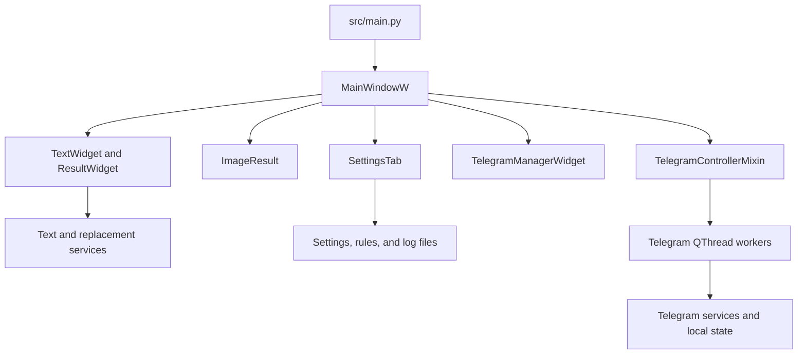

# Architecture

[Documentation index](README.md) · [Telegram implementation](TELEGRAM_INTEGRATION.md)

TextEdtor separates PyQt6 widgets from text/settings services and Telegram operations. This page describes the current source tree.

## Entry point and layout

`src/main.py` creates `QApplication`, initializes file logging, loads the QSS stylesheet and check-mark asset, and opens a `QMainWindow` with `MainWindowW` as its central widget. The title uses `texteditor.__version__`.

`MainWindowW` inherits `TelegramControllerMixin` and owns a `QStackedWidget` with two pages:

1. Main editor: image/results on the left, source text in the center, settings/buttons on the right.
2. Saved Messages manager: recent-message list and replacement rules on the left, text/caption editor on the right.

## Source map

All paths below are relative to `src/texteditor/`.

| Module | Role |
| --- | --- |
| `__init__.py` | Application version string. |
| `config.py` | Runtime directories and filenames. |
| `ui/main_window_widget.py` | Page composition, text cleanup/splitting, replacement-rule actions. |
| `ui/text_widget.py` | Central source-text editor. |
| `ui/result_widget.py` | Editable result, clipboard copying, Telegram send/status. |
| `ui/image_result_widget.py` | Paste/drop, Qt image conversion, source/output paths, file drag-out. |
| `ui/get_button_widget.py` | Cleanup/split/navigation controls and account status. |
| `ui/setting_widget.py` | Black list/settings/log tabs and log-file watcher. |
| `ui/setting_tabs/black_list_menu_widget.py` | Rule input, list, and context-menu deletion. |
| `ui/setting_tabs/setting_menu_widget.py` | Cleanup preferences, embedded Telegram auth, settings persistence. |
| `ui/telegram_auth_widget.py` | QR/phone/password form state. |
| `ui/telegram_controller.py` | Worker lifecycle, Telegram signals, navigation and operation results. |
| `ui/telegram_workers.py` | Auth/check/send/sync/edit/delete worker classes. |
| `ui/telegram_manager_widget.py` | Message row previews, selection, caption/text editing and deletion signals. |
| `ui/app_style.qss`, `ui/check_mark.svg` | Shared appearance and checkbox asset. |
| `services/black_list.py` | JSON replacement rules and cleanup operations. |
| `services/text_edit.py` | Exact `=====` split. |
| `services/save_func.py` | Cleanup and Telegram credential settings; removes a legacy bot-token setting on load. |
| `services/app_logger.py` | File logging setup and logger factory. |
| `services/telegram/` | Client lifecycle, authentication, messages, errors, and JSON storage. |

## Data flow

### Text and images

- **Accept black list** reads the central editor and current checkbox states, loads saved rules, and writes cleaned text back to the editor.
- **Split text** removes old result widgets and creates editable snapshots from `text_division()`.
- **Copy** uses the result's current plain text through `pyperclip`.
- The image widget keeps source and converted file paths. Conversion uses `QImage`, saves to a fixed output filename, updates the clipboard/preview, and enables dragging a local file URL.
- **Push to TG** combines a result's current text with the image widget's current file path.

### Persistence and logging

`config.py` derives `ROOT_DIR` from its own file location. In source runs it resolves to the repository root; it does not depend on the terminal's working directory. For bundled builds, see [runtime path details](RELEASE.md#runtime-paths-in-packaged-builds).

`data/` contains replacement rules, settings, logs, the Telegram session, login state, date-marker state, and cached messages. `images/` contains pasted/converted images. See the complete [runtime file table](../README.md#runtime-files).

Rules are saved on **Confirm**; settings on **Save settings**. Text drafts/results and image selection are not restored at startup. `SettingsTab` watches `app.log` with `QFileSystemWatcher`, reloads it, and restores the watch after changes.

### Telegram

Widgets emit signals; the controller creates workers; workers call synchronous service entry points that run async Telethon operations under a process-local lock. Result/error signals update widgets on the UI thread. Network history refresh is explicit; a failed sync falls back to cached records. See the [Telegram reference](TELEGRAM_INTEGRATION.md) for the full lifecycle and message schema.

## Manual verification

There is no automated test suite in the repository. Check the areas affected by a change; use disposable sample messages for Telegram mutations.

| Area | Check |
| --- | --- |
| Startup | Run `python src/main.py` from the configured environment; verify the stylesheet and both pages load. |
| Cleanup | Add a unique rule, apply it, try both cleanup options, and delete the rule through its context menu. |
| Splitting | Try one/multiple/empty segments; edit a result and verify **Copy** uses that edit. |
| Persistence | Save preferences, restart, and verify rules/preferences reload. |
| Images | Paste/drop a test image; convert each supported format; verify output, clipboard, and file drag-out. |
| QR auth | Save credentials, scan QR, complete 2FA when enabled, and verify reconnect after restart. |
| Phone auth | Check code/password step visibility against the [known UI limitations](TELEGRAM_INTEGRATION.md#current-authentication-ui-gaps). |
| Sending | Try text, an image caption, and long text; verify block status and daily marker in Saved Messages. |
| Manager | Refresh; select text/caption/uncaptioned media; edit and delete disposable messages; verify cache fallback on a failed sync. |
| Logs | Check file/tab updates and useful error messages. |
| Packaging | Use the [release checklist](RELEASE.md#prepare-a-release) and start the generated executable. |

Keep live credentials, sessions, and message caches out of test fixtures and committed files.

## Current boundaries

The app has a fixed split separator, fixed image output names, one Telegram session/cache context, a 30-message manager, and no draft autosave. The manager provides text/media-label previews and caption/text edits. Phone form transitions, background-worker shutdown, and retry deduplication have gaps described in the [Telegram reference](TELEGRAM_INTEGRATION.md). The Windows release is portable and unsigned.
