# Telegram Integration

This document describes every Telegram-related part of TextEdtor: authentication,
local files, background workers, sending to Saved Messages, message management,
security boundaries, and failure handling.

## 1. Purpose

TextEdtor uses Telegram as a personal output destination. It signs in as a normal
Telegram user through the Telegram Client API and writes to that user's
**Saved Messages** chat.

The integration does not use a bot token or the Telegram Bot API.

Main capabilities:

- sign in by QR code;
- sign in by phone number and Telegram login code;
- support Telegram two-step verification (2FA);
- preserve an authorized local session;
- send split text blocks to Saved Messages;
- attach the current image;
- send one date hashtag before the first message of each day;
- load the latest 30 Saved Messages;
- preview text and media;
- edit text messages and media captions;
- delete Saved Messages.

## 2. Technology

| Component | Purpose |
| --- | --- |
| Telethon | Telegram Client API / MTProto client |
| `qrcode` | Converts a Telegram QR login URL into a PNG |
| PyQt6 `QThread` | Keeps network calls outside the UI thread |
| Telethon SQLite session | Stores Telegram authorization locally |
| JSON runtime files | Store settings, daily hashtag state, and cached messages |

Dependencies are declared in `requirements.txt`:

```text
Telethon==1.43.0
qrcode[pil]==8.2
```

## 3. High-Level Architecture

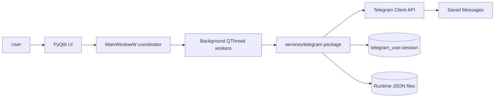

Responsibilities:

- UI widgets collect input and display state.
- `MainWindowW` connects signals, creates workers, and updates widgets.
- worker classes run blocking Telegram operations away from the main UI thread.
- `services/telegram/` owns Telethon calls and Telegram-specific rules.
- `data/` contains local runtime state and is ignored by Git.

## 4. Source Files

| File | Responsibility |
| --- | --- |
| `src/texteditor/services/telegram/client.py` | Client creation, credential validation, serialized event loops |
| `src/texteditor/services/telegram/auth.py` | QR, phone code, 2FA, account checks |
| `src/texteditor/services/telegram/messages.py` | Saved Messages send, history, edit, delete |
| `src/texteditor/services/telegram/storage.py` | Runtime JSON reads and atomic writes |
| `src/texteditor/services/telegram/errors.py` | Telegram application exceptions |
| `src/texteditor/ui/main_window_widget.py` | Main page composition and text editor behavior |
| `src/texteditor/ui/telegram_controller.py` | Telegram UI orchestration and navigation |
| `src/texteditor/ui/telegram_workers.py` | Background Qt workers |
| `src/texteditor/ui/telegram_auth_widget.py` | Progressive QR/phone/2FA form |
| `src/texteditor/ui/setting_tabs/setting_menu_widget.py` | General settings host and persistence |
| `src/texteditor/ui/result_widget.py` | `Push to TG` button and per-message status |
| `src/texteditor/ui/get_button_widget.py` | Global Telegram connection status |
| `src/texteditor/ui/telegram_manager_widget.py` | Saved Messages list, editor, delete controls |
| `src/texteditor/services/save_func.py` | Saves API credentials and phone configuration |
| `src/texteditor/config.py` | Runtime paths |

## 5. Runtime Files

All files below are created locally under `data/`.

| Path | Contents | Sensitivity |
| --- | --- | --- |
| `data/save_settings.json` | `api_id`, `api_hash`, phone, text settings | Sensitive configuration |
| `data/telegram_user.session` | Authorized Telethon session | Critical: grants account access |
| `data/telegram_user.session-journal` | Temporary SQLite journal, if present | Critical |
| `data/telegram_login.json` | Temporary phone code hash | Sensitive, temporary |
| `data/telegram_state.json` | Last daily hashtag sent | Low sensitivity |
| `data/telegram_messages.json` | Cached metadata/text for latest messages | Private message data |
| `data/app.log` | Application and Telegram operation logs | May contain operational details |

The entire `data/` directory and explicit session patterns are ignored in
`.gitignore`.

Never include `data/` in a source archive, release archive, bug report, or
public repository.

## 6. Credentials and Session

### API ID and API hash

`api_id` and `api_hash` identify the Telegram application created at
`my.telegram.org`.

They are required for both QR and phone authentication.

They do not authorize a user account by themselves. Account authorization is
stored separately in the Telethon session.

### Phone number

The phone number is required only for the **Phone and code** login mode. QR
login does not require it.

### Telegram login code

The login code is temporary and used only in the phone login flow. It may be
delivered to an active Telegram session instead of SMS.

The code is never persisted by TextEdtor.

### 2FA cloud password

This is the Telegram two-step verification cloud password. It is not:

- the Telegram app PIN;
- the phone unlock PIN;
- a one-time Telegram login code.

The password is kept only in the current UI field and is not saved to disk.

### Session file

After successful authorization, Telethon writes:

```text
data/telegram_user.session
```

Future launches reuse this file, so login is normally required only once.

Deleting the session file signs TextEdtor out locally. Revoking the session
from Telegram's **Settings -> Devices** invalidates it remotely.

## 7. Progressive Authentication UI

`SettingMenu` always shows:

- Telegram API ID;
- Telegram API hash;
- login mode selector.

It conditionally displays the rest.

### QR mode

Initial fields:

- API ID;
- API hash;
- `Generate QR code`.

After Telegram requests 2FA:

- cloud password field;
- `Sign in`.

### Phone mode

Initial fields:

- API ID;
- API hash;
- phone number;
- `Send code`.

After Telegram accepts the code request:

- login code field;
- `Sign in`.

After Telegram requests 2FA:

- cloud password field;
- `Sign in`.

## 8. QR Authentication Flow

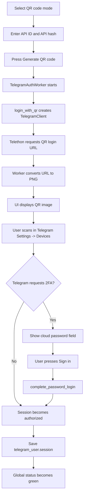

Important behavior:

- QR URLs expire after approximately two minutes.
- A QR accepted by Telegram may still require 2FA.
- When QR was accepted and 2FA is required, the user should enter the cloud
  password and press `Sign in`; scanning another QR is unnecessary.

## 9. Phone Authentication Flow

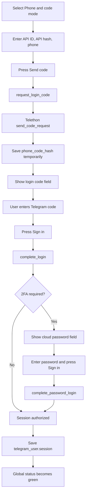

`data/telegram_login.json` stores only the temporary `phone_code_hash`, allowing
the code entry step to continue after an application restart. The actual login
code is not stored.

## 10. Connection Check

`check_telegram_account()` checks the authorized user session.

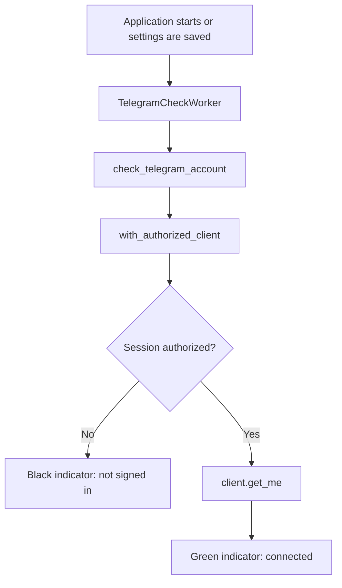

The global indicator is located below the main buttons.

## 11. Sending a Split Block

Each `ResultWidget` contains:

- `Copy`;
- `Push to TG`;
- status dot and label.

Status states:

| State | Color | Meaning |
| --- | --- | --- |
| Idle | Black | Not sent or failed |
| Sending | Yellow | Worker is running |
| Sent | Green | Telegram accepted the message |

### Send Flow

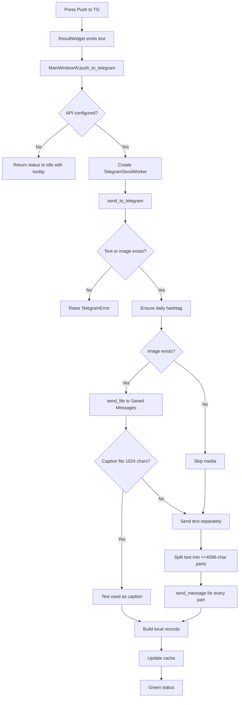

## 12. Daily Date Hashtag

Before the first successful content send of the day, TextEdtor sends:

```text
#YYYY_MM_DD
```

Example:

```text
#2026_06_15
```

Slashes are not used because `/` terminates a Telegram hashtag.

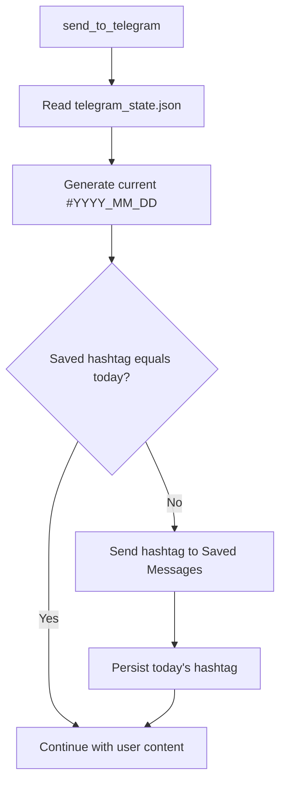

State is stored as:

```json
{
  "saved_messages_hashtag": "#2026_06_15"
}
```

## 13. Text and Media Rules

### Text

- Empty text is rejected unless an image exists.
- Text messages are split into parts of at most 4096 characters.
- When possible, splitting occurs at a newline.

### Image

- The current source or converted image path comes from `ImageResult`.
- Telethon uploads it with `client.send_file("me", ...)`.
- If text is at most 1024 characters, it becomes the media caption.
- Longer text is sent as separate messages.

### Message classification

`_record_from_message()` converts a Telethon message into a UI record:

| Type | Condition | Editable |
| --- | --- | --- |
| `text` | No media | Yes |
| `caption` | Media plus text | Yes |
| `media` | Media without text | No |

Recognized media labels include Photo, Video, Voice message, Audio, Animation,
Sticker, Document, and generic Media.

## 14. Saved Messages Manager

Open the manager with `Telegram manager`.

The page contains:

- latest 30 Saved Messages;
- message ID;
- media label;
- first two text lines;
- width-limited preview with ellipsis;
- delete icon;
- full text editor;
- `Update in TG`;
- black-list management block.

### History Loading

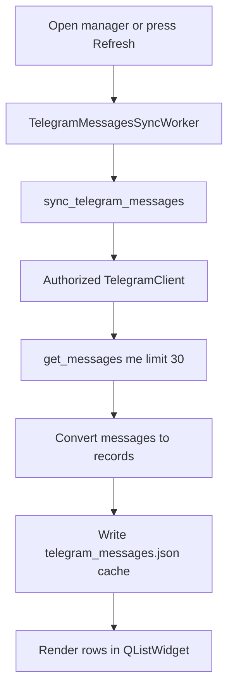

The source of truth is Telegram Saved Messages. The JSON file is only a local
fallback/cache.

### Preview Generation

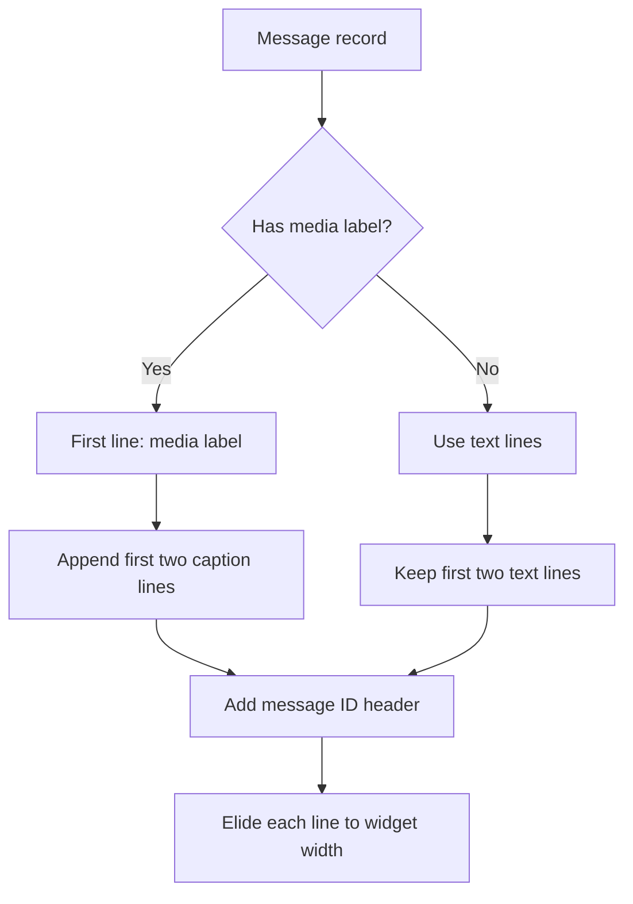

## 15. Editing Messages

Only `text` and `caption` records are editable.

Limits:

- text: 4096 characters;
- caption: 1024 characters.

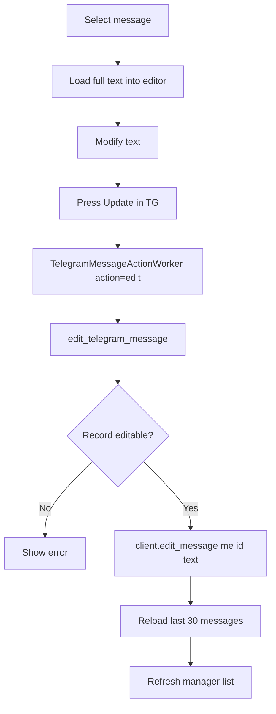

Media without a caption cannot be edited by this UI. It can still be deleted.

## 16. Deleting Messages

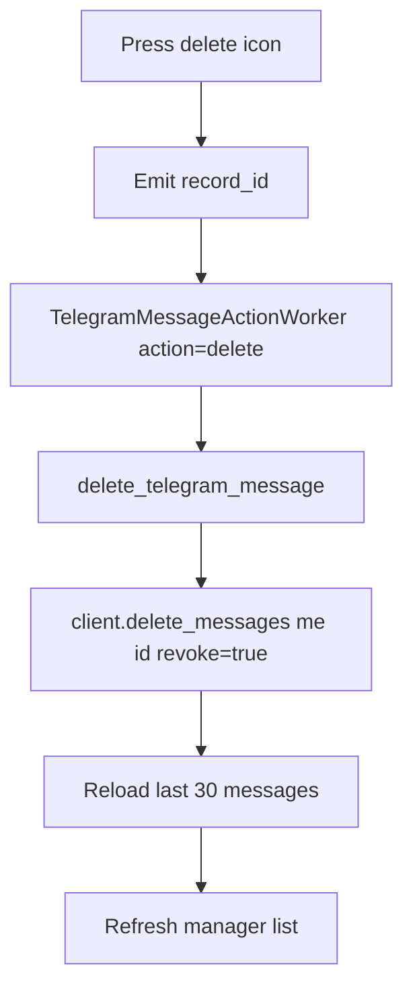

Because this is the user's own Saved Messages chat, deletion directly affects
the Telegram account.

## 17. Threading Model

Telethon operations are blocking from the perspective of the Qt UI, so they run
inside `QThread` subclasses.

| Worker | Operation |
| --- | --- |
| `TelegramAuthWorker` | Code request, code login, QR login, 2FA completion |
| `TelegramCheckWorker` | Authorization/session check |
| `TelegramSendWorker` | Send text and media |
| `TelegramMessagesSyncWorker` | Load last 30 Saved Messages |
| `TelegramMessageActionWorker` | Edit or delete a message |

The service itself serializes Telethon event loops with `_client_lock`. This
prevents two worker threads from concurrently operating on the same SQLite
session file.

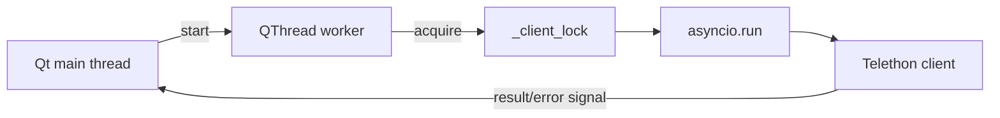

## 18. Function Reference: Telegram Service

### Exceptions

#### `TelegramError`

Common application-level Telegram exception. UI workers catch it and emit a
human-readable error signal.

#### `TelegramPasswordRequired`

Specialized error indicating that Telegram accepted the first authentication
step but requires the cloud 2FA password.

### Client and validation helpers

#### `validate_credentials(credentials, require_phone=False)`

- parses `api_id` as an integer;
- requires `api_hash`;
- optionally requires a phone number;
- returns `(api_id, api_hash, phone)`.

#### `run_telegram(coroutine)`

- acquires `_client_lock`;
- executes one async operation with `asyncio.run`;
- translates common Telethon exceptions into `TelegramError`.

#### `create_client(credentials)`

Creates a `TelegramClient` using `data/telegram_user` as the session path and
disables background update reception.

#### `with_authorized_client(credentials, operation)`

- connects the client;
- verifies authorization;
- runs the supplied async operation;
- always disconnects.

### Authentication functions

#### `request_login_code(credentials)`

- requires phone credentials;
- calls `send_code_request`;
- stores `phone_code_hash` in memory and `telegram_login.json`;
- reports the actual delivery type and expected code length.

#### `complete_login(credentials, code, password="")`

- restores `phone_code_hash`;
- submits the login code;
- completes 2FA immediately if the password was supplied;
- deletes temporary login state after success.

#### `complete_password_login(credentials, password)`

Completes an already-started QR or code login when only the 2FA cloud password
remains.

#### `login_with_qr(credentials, qr_callback, password="")`

- requests a QR login URL;
- passes it to the UI callback;
- waits up to 120 seconds for scanning;
- handles optional 2FA.

#### `sent_code_message(sent_code)`

Converts Telethon delivery metadata into readable status text: active app, SMS,
call, email, and other supported methods.

#### `check_telegram_account(credentials)`

Historical name. Verifies the user session and returns basic account identity
from `get_me()`.

### Local state helpers

#### `load_json(path, default)`

Reads a JSON runtime file and returns a default value on missing/invalid input.

#### `save_json(path, value)`

Writes JSON through a temporary file followed by `os.replace`, reducing the
chance of partial files.

#### `daily_hashtag()`

Returns today's local date as `#YYYY_MM_DD`.

#### `send_daily_hashtag_if_needed(client)`

Checks persisted date state and sends the date marker when required.

### Message conversion and cache

#### `media_label(message)`

Determines a readable media type from a Telethon message.

#### `record_from_message(message)`

Normalizes Telethon messages into dictionaries consumed by the UI.

#### `save_message_records(records)`

Writes the latest normalized records to `telegram_messages.json`.

#### `get_telegram_messages(credentials, limit=30)`

Reads the local message cache without a network request.

#### `sync_telegram_messages(credentials, limit=30)`

Loads the latest Saved Messages from Telegram and refreshes the local cache.

### Message actions

#### `send_to_telegram(credentials, text, image_path=None)`

Sends the daily marker, optional image, and text parts to Saved Messages.

#### `edit_telegram_message(credentials, record_id, text)`

Validates message type/length, edits the Telegram message, and refreshes cache.

#### `delete_telegram_message(credentials, record_id)`

Deletes a Saved Message by ID and refreshes cache.

## 19. Function Reference: UI Coordination

### Authentication

| Method | Purpose |
| --- | --- |
| `telegram_credentials()` | Reads API ID/hash/phone from settings |
| `telegram_api_configured()` | Checks API ID and API hash |
| `request_telegram_login_code()` | Starts phone code request |
| `complete_telegram_login()` | Submits code or standalone 2FA password |
| `start_telegram_qr_login()` | Starts QR flow |
| `start_telegram_auth()` | Creates/configures `TelegramAuthWorker` |
| `telegram_auth_succeeded()` | Resets progressive UI and checks connection |
| `telegram_auth_failed()` | Shows error and reveals 2FA field when needed |
| `telegram_qr_ready()` | Displays generated QR PNG |
| `telegram_auth_finished()` | Releases worker |

### Sending

| Method | Purpose |
| --- | --- |
| `push_to_telegram()` | Reads text/image and starts send worker |
| `telegram_send_finished()` | Marks split block green and updates cache |
| `telegram_send_failed()` | Returns split status to idle and stores tooltip |
| `telegram_worker_finished()` | Releases send worker |

### Connection

| Method | Purpose |
| --- | --- |
| `check_telegram_connection()` | Starts account/session verification |
| `telegram_connection_succeeded()` | Sets global status green |
| `telegram_connection_failed()` | Sets global status disconnected |
| `telegram_check_finished()` | Releases check worker |

### Manager

| Method | Purpose |
| --- | --- |
| `open_telegram_manager()` | Opens manager and starts history sync |
| `open_main_page()` | Returns to editor |
| `refresh_telegram_messages()` | Chooses network sync or local cache |
| `telegram_messages_loaded()` | Renders records |
| `telegram_messages_load_failed()` | Falls back to cached records |
| `update_telegram_message()` | Starts edit action |
| `delete_telegram_message()` | Starts delete action |
| `start_telegram_message_action()` | Creates action worker |

## 20. Error Handling

Common errors and expected UI behavior:

| Error | Meaning | User action |
| --- | --- | --- |
| API ID/hash invalid | Telegram application credentials are wrong | Check `my.telegram.org` |
| Phone invalid | Number format/account is invalid | Include country code |
| Code invalid | Wrong login code | Re-enter the newest code |
| Code expired | Code is too old | Request another code |
| 2FA required | First login step succeeded | Enter Telegram cloud password |
| Password invalid | Wrong cloud password | Check Telegram 2FA password |
| QR expired | QR was not scanned in time | Generate another QR |
| Flood wait | Too many Telegram requests | Wait for the reported duration |
| Account not signed in | Session missing or revoked | Authenticate again |

Errors are:

- written to `data/app.log`;
- shown in the authentication status label;
- shown as manager operation status;
- stored as a tooltip for split-send failures.

## 21. Security Model

### Most sensitive asset

`data/telegram_user.session` is more sensitive than the API hash. Anyone with a
valid session file may be able to use the authorized Telegram account.

### Current protections

- `data/` is ignored by Git;
- explicit `*.session` patterns are ignored;
- login code and 2FA password are not saved;
- temporary JSON writes use replacement;
- Telegram operations are serialized;
- no credentials are hard-coded in source.

### Current limitations

- `api_hash` and phone are stored as plaintext in `save_settings.json`;
- the session file is not encrypted by TextEdtor;
- local message cache contains private Saved Messages text;
- logs are plaintext.

### Distribution checklist

Before publishing source or a release:

1. Verify `git status` contains no `data/` files.
2. Never package the local `data/` directory.
3. Never upload `telegram_user.session`.
4. Never upload `save_settings.json`.
5. Never upload `telegram_login.json`.
6. Revoke unknown TextEdtor sessions from Telegram **Settings -> Devices**.
7. Avoid sharing logs that contain personal operational details.

## 22. Manual Verification Checklist

### QR login

1. Enter API ID/hash.
2. Select `QR code`.
3. Generate and scan QR.
4. Enter cloud password if requested.
5. Confirm green account status after restart.

### Phone login

1. Select `Phone and code`.
2. Enter phone and request code.
3. Confirm the code field appears.
4. Enter code and sign in.
5. Complete 2FA if requested.

### Sending

1. Split text.
2. Send a text-only block.
3. Confirm yellow then green status.
4. Add an image and send again.
5. Confirm both appear in Saved Messages.
6. Confirm the daily hashtag appears only once.

### Manager

1. Open Telegram manager.
2. Confirm up to 30 current Saved Messages.
3. Verify text/media previews.
4. Edit a text message.
5. Edit a media caption.
6. Delete a message.
7. Restart and verify history reloads from Telegram.

## 23. External Documentation

- Telegram API ID and hash: <https://core.telegram.org/api/obtaining_api_id>
- Telethon documentation: <https://docs.telethon.dev/>
- Telegram active sessions: Telegram **Settings -> Devices**
