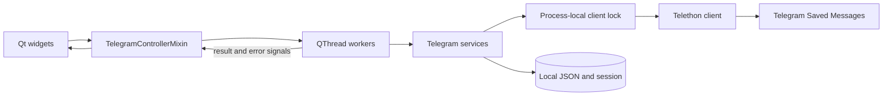
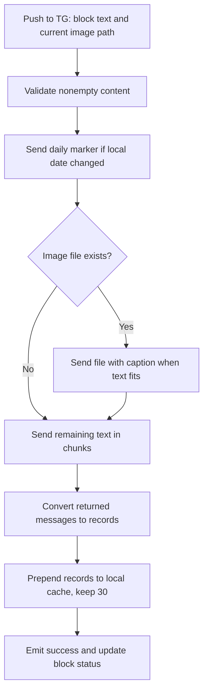

# Telegram Integration Reference

[Documentation index](README.md) · [Telegram UI guide](TELEGRAM_UI.md) · [Architecture](ARCHITECTURE.md)

This reference describes the current source implementation. For button-by-button instructions, use the Telegram UI guide. The published v0.1.1 executable predates these services.

## Scope and dependencies

TextEdtor uses a Telegram **user session** through Telethon's MTProto client. All messaging operations target `"me"` (Saved Messages). There is no Bot API, bot token, chat selector, or channel publishing flow.

The pinned direct dependencies are in [requirements.txt](../requirements.txt): `Telethon==1.43.0`, `qrcode[pil]==8.2`, `PyQt6==6.10.2`, and `pyperclip==1.11.0`. Qt handles application images; `qrcode` produces the login QR PNG.

## Components



Paths below are relative to `src/texteditor/`.

| Module | Responsibility |
| --- | --- |
| `ui/main_window_widget.py` | Composes the main/manager pages and inherits the Telegram controller mixin. |
| `ui/telegram_controller.py` | Connects UI signals, starts and retains workers, changes pages, updates statuses/cache views. |
| `ui/telegram_auth_widget.py` | API fields and progressive QR/phone/password controls. |
| `ui/telegram_manager_widget.py` | Message rows, media labels, editor, delete signals, shared replacement-rule panel. |
| `ui/result_widget.py` | Per-block send signal and status. |
| `ui/get_button_widget.py` | Account status and manager navigation button. |
| `ui/telegram_workers.py` | Qt background workers and QR PNG generation. |
| `services/telegram/client.py` | Credential validation, client creation, serialized async calls, error mapping. |
| `services/telegram/auth.py` | QR, phone-code, password completion, and account checks. |
| `services/telegram/messages.py` | Send, sync, edit, delete, daily marker, and message-record conversion. |
| `services/telegram/storage.py` | JSON reads with defaults and writes via temporary-file replacement. |
| `services/telegram/errors.py` | `TelegramError` and `TelegramPasswordRequired`. |
| `services/save_func.py` | Persist API credentials/phone alongside cleanup preferences. |
| `config.py` | All runtime paths. |

## Credentials and authentication

UI credentials use the keys `api_id`, `api_hash`, and `phone`. `validate_credentials()` converts `api_id` to an integer, requires a nonempty hash, and requires the phone only for phone-code operations. Server-side validation still applies.

Obtain application credentials through [Telegram's API development tools](https://core.telegram.org/api/obtaining_api_id). The authorized user session is a separate file.

| Function in `auth.py` | Behavior |
| --- | --- |
| `request_login_code(credentials)` | Calls `send_code_request`, saves the phone and code hash, and reports delivery metadata. |
| `complete_login(credentials, code, password="")` | Restores the code hash, submits the code, optionally submits 2FA, then removes temporary phone state on this success path. |
| `complete_password_login(credentials, password)` | Completes authorization when only the cloud password remains. |
| `login_with_qr(credentials, qr_callback, password="")` | Creates a login URL, passes it to the callback, waits up to 120 seconds, and handles 2FA. |
| `check_telegram_account(credentials)` | Uses the authorized session and `get_me()` to return account ID/name. |
| `sent_code_message(sent_code)` | Formats Telegram's actual delivery method, expected code length, and timeout when available. |

`TelegramAuthWorker` converts the QR URL to PNG bytes and emits `qr_ready`. For `sign_in`, a nonempty code selects `complete_login`; otherwise it selects `complete_password_login`.

The QR token's expiry is controlled by Telegram; the 120-second wait is an application timeout, not a guaranteed token lifetime. Login codes/passwords are not persisted. Successful authorization resets the form; saving API credentials requires **Save settings**.

### Current authentication UI gaps

- After `code_sent`, the worker also emits `succeeded`. `telegram_auth_succeeded()` unconditionally resets the form, hiding the phone-code entry step.
- Password visibility depends on error text containing `2FA password` or `cloud password`. Some phone errors use `Two-step verification password` and miss that check.
- The service can reload `phone_code_hash`, but the widget does not restore its phone-code step after restart.
- Temporary phone state is removed by the normal `complete_login` success path; QR/password-only paths do not perform the same cleanup.

These are current behavior, not supported recovery guarantees. The user guide recommends QR login.

## Workers and client lifecycle

| Worker | Signals / work |
| --- | --- |
| `TelegramAuthWorker` | QR bytes, code/password step signals, success/error. |
| `TelegramCheckWorker` | Connected/error after account check. |
| `TelegramSendWorker` | Sent records/error for a result block. |
| `TelegramMessagesSyncWorker` | Loaded records/error for history. |
| `TelegramMessageActionWorker` | Edit/delete success/error. |

Workers run network operations outside the Qt UI thread. `run_telegram()` acquires `_client_lock` and executes the coroutine with `asyncio.run()`. Each operation creates a client using the fixed session path, and normal connected operations disconnect in a `finally` block. `with_authorized_client()` verifies authorization before calling the supplied operation.

The lock serializes operations **within one process**. It does not coordinate multiple app instances. A QR wait can delay other workers. `receive_updates=False` means there is no subscription to incoming history updates; the manager synchronizes explicitly.

The controller suppresses overlapping account checks, history syncs, and auth workers of the same type. Send/action workers are retained in lists until completion; duplicate send clicks are not deduplicated. There is no general worker cancellation or shutdown-drain mechanism in the current UI.

## Send pipeline



`send_to_telegram(credentials, text, image_path=None)` strips surrounding whitespace and checks for an existing image file. The selected path is the converted image when available, otherwise the source image. This path is global to the image widget and reused across block sends.

- An image receives a caption when the stripped text is at most 1,024 characters.
- Longer text is sent after the image as separate messages.
- Text chunks are at most 4,096 Python characters, preferring the last newline in that range; leading newlines are stripped between chunks.
- The code does not override Telethon's parse mode. Formatting-like text is subject to Telethon parsing; the application's `len()` limits are not a guarantee of Telegram acceptance.
- An empty block is allowed with an image; otherwise it raises `TelegramError`.

### Daily hashtag and partial sends

`daily_hashtag()` uses `datetime.now()` to create `#YYYY_MM_DD` in local computer time. `send_daily_hashtag_if_needed()` compares it with `saved_messages_hashtag` in `telegram_state.json`, sends it, and saves the new value immediately.

The marker is not included in the returned content records; history synchronization retrieves it later. State is shared by the installation, not keyed by account.

Sending is not transactional. A marker, image, or earlier text chunk may already be in Telegram when a later operation fails. The final content cache is written only after the send loop completes. There is no rollback or retry deduplication; refresh Saved Messages before repeating a failed send.

## History and record schema

`sync_telegram_messages(credentials, limit=30)` downloads `get_messages("me", limit=limit)`, maps each result with `record_from_message()`, and replaces the local cache. The manager uses 30. `get_telegram_messages()` reads only the cache and ignores its credentials argument.

Example record (synthetic data):

```json
{
  "record_id": "104",
  "chat_id": "Saved Messages",
  "message_id": 104,
  "message_type": "text",
  "media_label": "",
  "text": "Example note",
  "editable": true,
  "direction": "outgoing",
  "created_at": "2026-09-15T12:00:00+03:00"
}
```

`direction` is assigned `outgoing` by the converter; it is not inferred from the Telegram message. Dates are converted to local time. Media labels include Photo, Video, Voice message, Audio, Animation, Sticker, Document, and generic Media, selected by the checks in `media_label()`.

| `message_type` | Classification | Editable in this app |
| --- | --- | --- |
| `text` | No recognized media label. | Yes. |
| `caption` | Media label and nonempty text. | Yes. |
| `media` | Media label without text. | No. |

History includes Saved Messages created outside TextEdtor. UI previews contain IDs, labels, and text, not downloaded media. Sync replaces the cache with server order. Local send results are prepended in send order, so a multi-message send may appear in a different order until the next sync.

## Edit and delete

`edit_telegram_message()` requires a cached editable record, nonempty stripped text, and an application limit of 1,024 characters for captions or 4,096 for text. It calls `edit_message("me", message_id, text)` and then synchronizes history. The UI cannot add a caption to an uncaptioned media record, remove a caption entirely, or replace media.

`delete_telegram_message()` calls `delete_messages("me", [message_id], revoke=True)` and then synchronizes history. The trash icon triggers this immediately without confirmation or undo.

If the remote mutation succeeds but the follow-up sync fails, the worker reports an error even though Telegram may already have applied the change. A fresh **Refresh** resolves the displayed state when connectivity returns.

## Runtime storage

For source runs, paths are relative to the repository root. `config.py` computes this root from its own file location; bundled paths can differ (see [release guide](RELEASE.md#runtime-paths-in-packaged-builds)).

| Path | Data and handling |
| --- | --- |
| `data/save_settings.json` | `text_settings`, `empty_text_settings`, `telegram_api_id`, `telegram_api_hash`, `telegram_phone`; plaintext. |
| `data/telegram_user.session` | Telethon SQLite authorization/session data; may grant account access. |
| `data/telegram_user.session-journal` | SQLite journal when present. |
| `data/telegram_login.json` | Phone plus temporary `phone_code_hash`, not the submitted login code. |
| `data/telegram_state.json` | `saved_messages_hashtag` for the last marker sent. |
| `data/telegram_messages.json` | Up to 30 cached message records in normal UI use, including private text. |
| `data/app.log` | Plaintext application events and operation errors. |

Telegram JSON helpers read missing/unreadable/malformed files as the supplied default and write through `path.tmp` followed by `os.replace`. General settings and replacement-rule persistence use separate helpers and do not share that atomic-write implementation.

The fixed session/cache paths support one local account context. Merely changing the phone/API fields does not switch the authorized account. There is no account-switch or logout control. Close the app before managing session files; revoke the session through Telegram's **Settings → Devices** when access should end. Removing a local file alone does not revoke remote authorization. An old message cache may remain after session removal.

TextEdtor does not encrypt its settings, cache, or session. Git ignore rules prevent ordinary accidental tracking, but do not encrypt data or remove files already committed. Never distribute `data/`, sessions, or private logs in release archives or issue attachments.

## Errors and verification

`run_telegram()` converts surfaced flood waits, invalid API credentials, invalid phone numbers, and other exceptions into `TelegramError`. The UI shows auth status, account/send tooltips, or manager operation status, and logs failures. Some retry/wait behavior also occurs inside Telethon.

For recovery, see [troubleshooting](TROUBLESHOOTING.md). For verification before changing these modules, see the [manual checklist](ARCHITECTURE.md#manual-verification).

## External references

- [Telegram application credentials](https://core.telegram.org/api/obtaining_api_id)
- [Telethon client reference](https://docs.telethon.dev/en/stable/modules/client.html) — the live documentation may describe a newer version than the project's pinned dependency.
