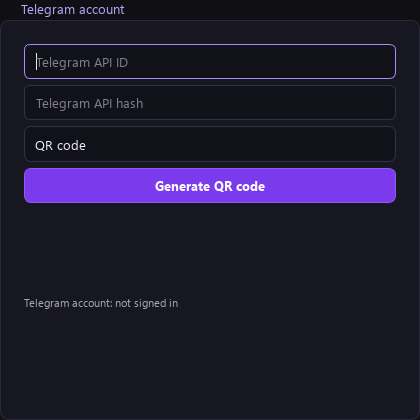
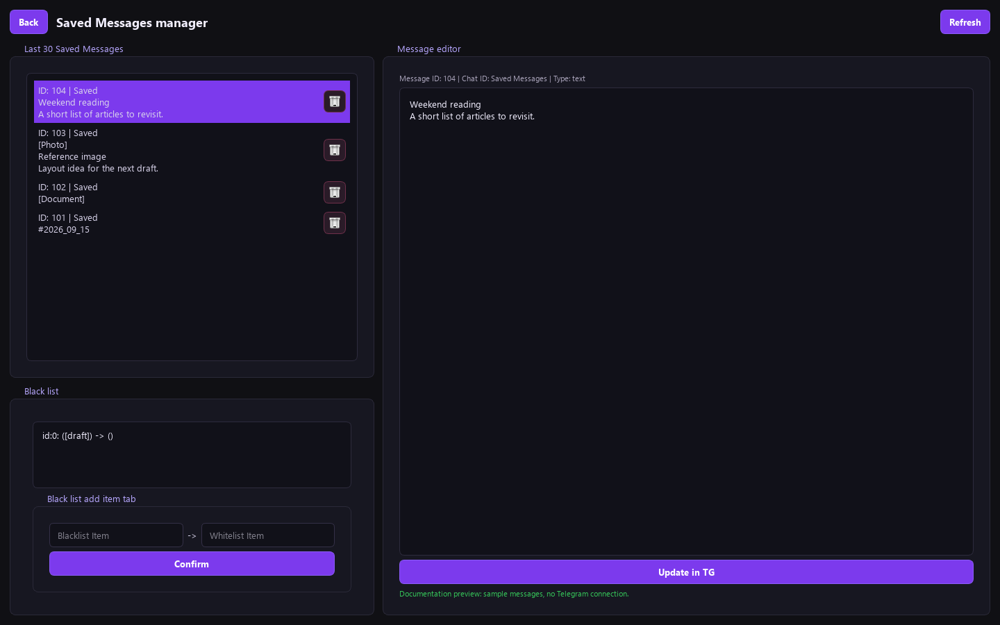

# Telegram UI Guide

[Documentation index](README.md) · [Usage](USAGE.md) · [Technical reference](TELEGRAM_INTEGRATION.md)

This guide covers the Telegram interface in the current `master` source. Telegram support is not included in the published v0.1.1 package. UI labels are written as they appear in the English interface; **Saved Messages** is Telegram's **Избранное**.

## Screen map

| Location | Controls and purpose |
| --- | --- |
| Main window → **Settings → Settings** | **Telegram account** form and **Save settings**. |
| Main window → **General Buttons** | **Telegram manager** and the account status indicator. |
| Each split result | Editable text, **Copy**, **Push to TG**, and a send status indicator. |
| **Saved Messages manager** | **Back**, **Refresh**, message list, trash icons, shared **Black list**, and **Message editor** with **Update in TG**. |
| Main window → **Settings → Log** | Operation details and **Refresh log**. |

## Before signing in

You need a Telegram user account and your application's `api_id` and `api_hash`. Sign in at [my.telegram.org](https://my.telegram.org), open **API development tools**, and create an application to obtain them. See [Telegram's API setup guide](https://core.telegram.org/api/obtaining_api_id).

Open **Settings → Settings → Telegram account**:

1. Enter **Telegram API ID** (a number).
2. Enter **Telegram API hash**.
3. Click **Save settings** to keep the credentials for future launches.

The integration uses your user account and always targets Saved Messages. There is no bot-token field or destination/channel selector. The API hash is masked on screen but stored as plaintext locally.



## QR code login

QR is the recommended login route for the current UI.

1. Select **QR code** in the login-mode selector.
2. Click **Generate QR code**.
3. Scan the displayed code using Telegram's device-linking screen on your phone, usually **Settings → Devices → Link Desktop Device**.
4. If the **Password for your Telegram account** field appears, enter your Telegram two-step verification cloud password and click **Sign in**. The accepted QR does not need to be scanned again for this password step.
5. Wait for **Telegram account: connected** below **General Buttons**.

The application waits up to 120 seconds for QR authorization; Telegram can expire the code earlier. After an expiry or timeout, use **Generate QR code** again. There is no automatic QR refresh or cancel button.

Successful login clears the code/password fields and QR image. The local session is reused on later launches, provided the API credentials were saved and the session is still valid.

## Phone and code

Select **Phone and code**, enter the phone number with its country code, and click **Save settings**. **Send code** requests a login code; the status message reports the delivery method supplied by Telegram. The code can arrive in an existing Telegram session rather than by SMS.

The phone form is designed to reveal **Login code from Telegram** and **Sign in** after a code request, then request a cloud password if two-step verification is enabled.

**Current limitations:** the success callback also resets the form after a successful code request, hiding the code field again. Some phone 2FA errors do not reveal the password field because the UI checks specific error wording. Use the QR flow if these occur. Saving the phone-code hash does not restore the UI step after restarting. See [troubleshooting](TROUBLESHOOTING.md#telegram-login).

## Account and send indicators

These indicators show different operations:

| Color | Under General Buttons | On a result block |
| --- | --- | --- |
| Black | **Telegram account: not signed in** — unconfigured or the check failed. | **Telegram: not sent** — idle or the send failed. |
| Yellow | **Telegram account: checking** — a check is running. | **Telegram: sending** — the request is running or waiting for another Telegram operation. |
| Green | **Telegram account: connected** — the last account check succeeded. | **Telegram: sent** — the send operation completed successfully. |

Hover over a status dot for details. A failed block send also puts the error in its status-label tooltip. The account indicator is checked on startup, after **Save settings**, and after successful login; it is not a continuous network monitor.

## Send a result block

1. Put text in **General Text Editor**, separating blocks with `=====`.
2. Click **Split text**. A single block works too; the separator is optional when sending one piece of text.
3. Review or edit the text inside the desired result block.
4. Optionally paste/drop an image in **Image result**. Use **Convert** first if you want to send the converted file.
5. Click that block's **Push to TG** and wait for its send result.
6. Check Telegram Saved Messages, or open **Telegram manager**.

### Text and image behavior

- **Push to TG** sends the result block's current text, not a fresh copy of the central editor.
- Leading/trailing whitespace is stripped before sending.
- The current image is shared across all result blocks and is attached on every send while loaded. A converted image takes precedence over the source file.
- The image panel has no clear/remove button yet. For a text-only send after loading an image, copy any unsaved text and restart the app without loading an image.
- With an image, text up to 1,024 characters is used as its caption. Longer text follows the image in separate messages.
- Text is divided into parts of up to 4,096 Python characters, preferably at a newline. Telegram may still reject content based on its own limits or formatting rules.
- An empty block can send an image. Without an image, empty text is rejected.
- Repeated clicks create additional sends; wait for completion and check Saved Messages before retrying a failure.

### Daily marker

Before content, the app sends `#YYYY_MM_DD` if its local saved marker differs from today's date. The date uses the computer's local time. For example:

```text
#2026_09_15
```

The marker is saved as soon as the marker send succeeds. It can therefore appear even if the following content fails. It may reappear if local state is reset. Press **Refresh** in the manager to include the marker in the downloaded history.

## Saved Messages manager

Click **Telegram manager** to open the page. It loads up to the latest 30 Saved Messages, including messages created outside TextEdtor.



*This screenshot uses sample records and no Telegram connection.*

| Control | Behavior |
| --- | --- |
| **Back** | Return to the editor and refresh its replacement-rule list. |
| **Refresh** | Fetch the latest 30 messages from Telegram. |
| Message row | Select a message and show its full text/caption in the editor. |
| Trash icon | Immediately delete that row's message from Telegram. |
| **Update in TG** | Replace the selected message's text or caption with the editor contents. |
| **Black list → Confirm** | Save a shared replacement rule. It does not apply rules to the selected Telegram message. |

Rows show an ID, a media type label when present, and up to two lines of text/caption. Long preview lines are shortened with an ellipsis. Images, video, and audio are represented by labels; they are not downloaded or played in this page.

### Edit text or a caption

1. Select a text message or media item that already has a caption.
2. Edit its text in **Message editor**.
3. Click **Update in TG** and wait for the operation status.

The app rejects empty edits, text over 4,096 characters, and captions over 1,024 characters. A media item without a caption is read-only in this UI. Media attachments themselves cannot be replaced.

### Delete a message

The row's trash icon sends a deletion request immediately. **There is no confirmation dialog or undo in TextEdtor.** Deletion affects Telegram Saved Messages, including messages created in other Telegram clients.

### Refresh and cached history

Opening the page and pressing **Refresh** fetch history from Telegram. If synchronization fails, the page shows the local cache and an error message. Cached rows can be stale; offline edits are not queued for later.

Refresh/update/delete results can reload the editor. Save intended edits with **Update in TG** before refreshing or changing selection. There is no unsaved-edit confirmation, pagination, or background history polling.

## Session and local data

**Save settings** persists API ID/hash/phone, separately from the authorized session. Login codes and cloud passwords are not written to settings. The login mode itself is not persisted.

The source app stores its session at `data/telegram_user.session` and cached message text at `data/telegram_messages.json`. There is no logout/account-switch button. To revoke access, close TextEdtor and terminate its session in Telegram's **Settings → Devices**. See the [storage reference](TELEGRAM_INTEGRATION.md#runtime-storage) before resetting local state.
