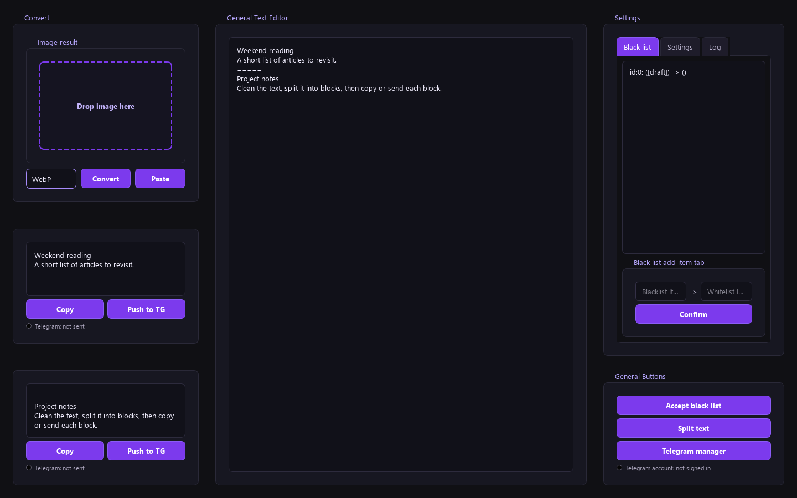

# Usage Guide

[Documentation index](README.md) · [Telegram UI](TELEGRAM_UI.md) · [Troubleshooting](TROUBLESHOOTING.md)

For installation, see the [quick start](../README.md#quick-start). This guide describes the current source UI.

## Main window

- **Left:** image conversion and result blocks created by **Split text**.
- **Center:** **General Text Editor**, the source text for cleanup and splitting.
- **Right:** **Settings** tabs, **General Buttons**, and Telegram account status.



## Replacement rules and cleanup

1. Paste or type text into **General Text Editor**.
2. Open **Settings → Black list**.
3. Enter the text to find in **Blacklist Item**, and its replacement in **Whitelist Item**.
4. Click **Confirm** to save the rule immediately.
5. In **Settings → Settings**, choose optional cleanup:
   - **Text settings** removes leading whitespace, including spaces and tabs, from each line.
   - **Empty text settings** reduces repeated blank/whitespace-only lines to one blank line.
6. Click **Save settings** to keep those preferences for the next launch.
7. Click **Accept black list** to apply the rules and current checkboxes to the central editor.

Rules use literal, case-sensitive text matching. An empty replacement removes the matching fragment. The search value must be nonempty and unique. To delete a rule, right-click its row and choose **Delete**.

Example rule: `[draft]` → an empty replacement.

```text
Before: [draft] Weekend reading
After:  Weekend reading
```

The manager page has a second **Black list** panel backed by the same saved rules. Adding a rule there does not apply it to an existing Telegram message; **Accept black list** operates on the central editor.

## Split and edit result blocks

Use this separator anywhere in the central text:

```text
=====
```

Example:

```text
First block
A note to keep.
=====
Second block
Another note.
```

Click **Split text** to create one editable result per segment. Each has:

- **Copy** — copy that result's current text to the clipboard.
- **Push to TG** — send that result to Telegram Saved Messages.
- A status dot and label for the send operation.

With no separator, splitting creates one result. Adjacent or leading/trailing separators create empty results. The separator is fixed and is not included in the results.

Result blocks are independent of the central editor after splitting. Editing a result does not update the source text; clicking **Split text** again replaces all result blocks and discards their edits and status indicators. Text drafts and result blocks are not saved across restarts.

## Images

1. Copy an image and click **Paste**, or drop a `.jpg`, `.jpeg`, `.png`, or `.webp` file into **Image result**.
2. Select **WebP**, **PNG**, or **JPEG**.
3. Click **Convert**.
4. Drag the converted preview into Explorer or another application that accepts dropped files.

For source runs, outputs use fixed filenames:

| Format | Output |
| --- | --- |
| WebP | `images/image.webp` |
| PNG | `images/image.png` |
| JPEG | `images/image.jpeg` |

Converting to the same format overwrites its previous output. Pasted images are initially saved as `images/image.png`. Conversion also puts the image in the clipboard. JPEG output uses RGB and does not preserve transparency.

File drag-out becomes available after conversion. Simply changing the format selector does not convert the image.

The current image is also used by every **Push to TG** click; a converted file takes precedence over its source. There is currently no remove-image control. See [sending behavior](TELEGRAM_UI.md#text-and-image-behavior) before switching to text-only sends.

## Telegram

1. Configure API credentials and use QR login in **Settings → Settings**.
2. Split your text and click a result's **Push to TG**.
3. Open **Telegram manager** to load the latest 30 Saved Messages.
4. Select a message, edit its text/caption, and click **Update in TG**.

The trash icon deletes directly from Telegram without a confirmation dialog. Follow the [Telegram UI guide](TELEGRAM_UI.md) for setup, statuses, media behavior, and current phone-login limitations.

## Settings and logs

Replacement rules are saved on **Confirm**. Cleanup preferences and Telegram credentials are saved by **Save settings**. The authorized Telegram session is stored separately. See [runtime files](../README.md#runtime-files).

Open **Settings → Log** to inspect events. The same events are appended to `data/app.log`; the tab watches for changes and also offers **Refresh log**.

Logs may contain replacement text, local paths, and Telegram error details. Share only relevant, redacted lines when reporting a problem.
